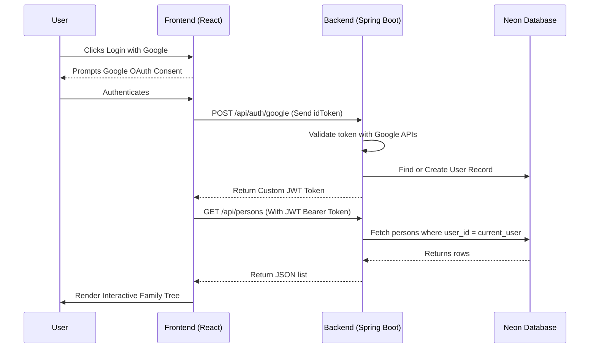

# System Architecture - PariVaar

This document provides a detailed overview of the system architecture, component breakdown, data models, and application flows for **PariVaar**.

---

## 1. Technical Stack

PariVaar utilizes a decoupled frontend-backend architecture designed for responsive visualization, fast query responses, and secure user-session boundaries.

### Frontend
- react - v18.3.1
- react-dom - v18.3.1
- vite - v2.9.18
- tailwindcss - v4.3.0
- @xyflow/react - v12.11.1
- react-organizational-chart - v2.2.1
- lucide-react - v1.17.0
- framer-motion - v12.40.0
- axios - v1.16.1
- @react-oauth/google - v0.13.5
- @emotion/react - v11.14.0
- @emotion/styled - v11.14.1

### Backend
- java - v17
- spring-boot - v3.3.2
- spring-boot-starter-web - v3.3.2
- spring-boot-starter-data-jpa - v3.3.2
- spring-boot-starter-security - v3.3.2
- postgresql (driver) - runtime
- google-api-client - v2.2.0
- jjwt (jjwt-api, jjwt-impl, jjwt-jackson) - v0.12.3
- maven (build automation)
- neon serverless postgres (database)

---

## 2. Directory Structure

The repository is divided into two primary root structures: `frontend` (React application) and backend source files (Spring Boot).

```text
Project-PariVaar/
│
└── PariVaar/
    ├── .github/
    │   └── workflows/
    │
    ├── Document/
    │   ├── Architecture.md
    │   ├── Design.md
    │   ├── Memory.md
    │   ├── PRD.md
    │   ├── Phases.md
    │   └── Rules.md
    │
    ├── frontend/
    │   ├── src/
    │   │   ├── api/
    │   │   │   └── api.js
    │   │   ├── components/
    │   │   │   └── auth/
    │   │   │       └── LoginForm.jsx
    │   │   ├── hooks/
    │   │   ├── pages/
    │   │   │   ├── Dashboard.jsx
    │   │   │   ├── FamilyTreePage.jsx
    │   │   │   ├── LandingPage.jsx
    │   │   │   └── LoginPage.jsx
    │   │   └── types/
    │   ├── vite.config.js
    │   └── package.json
    │
    └── src/
        ├── main/
        │   ├── java/com/example/family/
        │   │   ├── FamilyApplication.java
        │   │   ├── config/
        │   │   │   └── AsyncConfig.java
        │   │   ├── controller/
        │   │   │   ├── AuthController.java (POST /auth/google, POST /auth/signup, POST /auth/signin)
        │   │   │   ├── NoteController.java (GET /api/notes, POST /api/notes, GET /api/notes/hello)
        │   │   │   ├── PersonController.java (POST /api/person, GET /api/persons, GET /api/tree/{personId})
        │   │   │   ├── RelationshipController.java (POST /api/relationships)
        │   │   │   └── RelationshipResolveController.java (GET /api/relationships/resolve)
        │   │   ├── dto/
        │   │   │   ├── GoogleAuthRequest.java
        │   │   │   ├── RelationshipResolveResponse.java
        │   │   │   ├── SigninRequest.java
        │   │   │   └── SignupRequest.java
        │   │   ├── exception/
        │   │   ├── model/
        │   │   │   ├── AuditLog.java
        │   │   │   ├── Gender.java
        │   │   │   ├── NoteDocument.java
        │   │   │   ├── Person.java
        │   │   │   ├── RelationType.java
        │   │   │   ├── Relationship.java
        │   │   │   ├── User.java
        │   │   │   └── UserLogin.java
        │   │   ├── repository/
        │   │   │   ├── AuditLogRepository.java
        │   │   │   ├── NoteDocumentRepository.java
        │   │   │   ├── PersonRepository.java
        │   │   │   ├── RelationshipRepository.java
        │   │   │   ├── UserLoginRepository.java
        │   │   │   └── UserRepository.java
        │   │   ├── security/
        │   │   │   ├── JwtFilter.java
        │   │   │   ├── JwtUtil.java
        │   │   │   └── SecurityConfig.java
        │   │   └── service/
        │   │       ├── AsyncAuditService.java
        │   │       ├── FamilyTreeService.java
        │   │       └── RelationshipResolverService.java
        │   └── resources/
        │       └── application.properties
        └── test/
```

---

## 3. Data Model (JPA Entities)

PariVaar maps its domain objects using Hibernate annotations to establish relations, keys, and constraint checks. All data is scoped to the authenticated user via their unique Google Email.

### JPA Entities Overview

#### 1. `Person`
Represents an individual node in the family tree.
* **`id` (String)**: Primary Key. Generated uniquely on creation.
* **`name` (String)**: The individual's full name.
* **`gender` (Gender)**: String-mapped Enum containing values `M` (Male), `F` (Female), or `O` (Other/Unknown).
* **`userId` (String)**: Maps to the email address of the owner (Google email). Ensured as a non-null constraint (`user_id`).

#### 2. `Relationship`
Represents a directed link/connection between two people in the graph.
* **`id` (Long)**: Primary Key, automatically generated (`IDENTITY` strategy).
* **`sourcePersonId` (String)**: Starting person's unique identifier.
* **`targetPersonId` (String)**: Ending person's unique identifier.
* **`relation` (RelationType)**: Enum describing the connection (`SPOUSE`, `PARENT`, `SIBLING`, `CHILD`).
* **`userId` (String)**: Non-null owner's email identifier (`user_id`).

#### 3. `NoteDocument`
Contains rich markdown logs or biographical documents attached to individual members.
* **`id` (Long)**: Primary Key.
* **`noteName` (String)**: Heading or description of the note.
* **`content` (String)**: Stored as a database `TEXT` block containing formatted markdown contents.
* **`userId` (String)**: Owner's identifier.

#### 4. `UserLogin`
Audits session logs and initial registrations.
* **`id` (Long)**: Primary Key.
* **`email` (String)**: Google email of the user (non-null).
* **`firstName` (String)**: User's first name.
* **`lastName` (String)**: User's last name.
* **`loginTime` (LocalDateTime)**: Time of successful authorization.

#### 5. `AuditLog`
Keeps a persistent historical log of state changes (creations, edits, deletions).
* **`id` (Long)**: Primary Key.
* **`action` (String)**: The performed database action (e.g. `CREATE_PERSON`, `DELETE_RELATIONSHIP`).
* **`details` (String)**: Text block describing parameters and changes.
* **`threadName` (String)**: Track execution threads for asynchronous logs.
* **`createdAt` (LocalDateTime)**: Timestamp of log creation.

---

## 4. Application Flow

### Authentication Flow Sequence
Below is the sequence describing user authentication, JWT generation, and fetching owned resources.



## 5. Graph Traversal Flow (Relationship Resolver)
When a user requests to query the relationship between **Person A** and **Person B**:

1. **REST Request**: The frontend invokes `GET /api/relationship-resolve?sourceId=A&targetId=B`.
2. **User Context Scope**: The backend retrieves the authenticated `userId` from the incoming security token context.
3. **Graph Building**:
   - The `RelationshipResolverService` fetches all relationships owned by the current `userId`.
   - An adjacency list representation of the graph is built dynamically in-memory.
   - For reachability purposes, inverse edges are added (e.g., if A is a `PARENT` of B, a helper inverse edge of B as a `CHILD` of A is injected; spouse relationships get a bidirectional spouse connection).
4. **BFS Traversal**:
   - Starting from `sourceId`, a queue-based Breadth-First Search (BFS) is executed to find the shortest path to `targetId`.
   - A `prev` map tracks the parent path and the relation types traversed at each step.
5. **Path Construction**:
   - The shortest path path-relation list is retrieved by backtracking through the `prev` map.
   - The list is reversed to produce the chronological sequence from A to B.
6. **Relationship Title Derivation**:
   - The sequence of edge types (e.g., `Parent`, `Spouse`, `Child`) combined with target/source gender metadata is evaluated to resolve standard labels (e.g., "Grandfather", "Mother", "Wife", "Sibling").
7. **Response**: Returns a JSON payload containing the resolved relationship name, distance, and direct relation type sequence.


